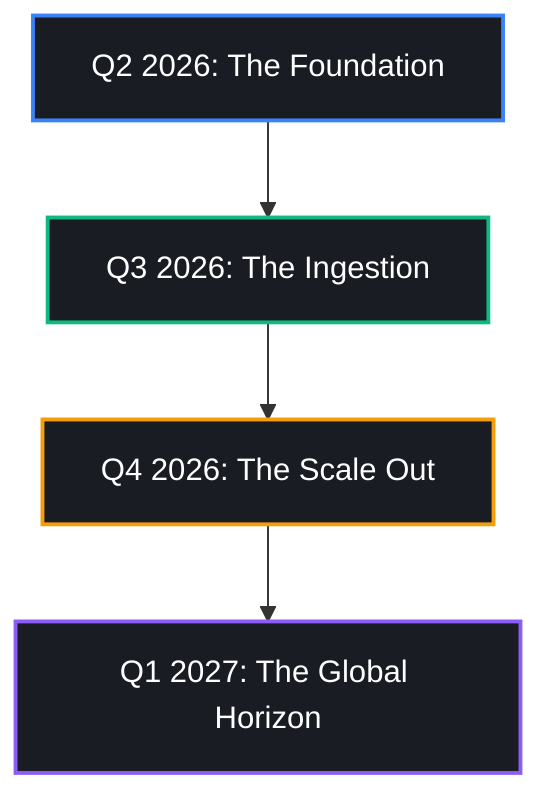

# BengalBound HUB — CEO Strategic Briefing
# BengalBound Ltd | "Light. Easy. Powerful."

> **Document Class:** Strategic Operations Playbook  
> **Prepared for:** Chief Executive Officer (CEO)  
> **Prepared by:** Principal AI Strategy Officer  
> **Date:** May 2026 | **Version:** 1.0  

---

## 🧭 1. Brand Vision & Market Philosophy

At BengalBound Ltd, our core philosophy is **iOS-Level Simplicity** applied to enterprise SaaS:
> *"Can a non-technical business owner perform this task in under 60 seconds?"*

If the answer is no, we redesign the feature. The BengalBound HUB is built on a "light and easy, yet incredibly powerful" foundation, mapping a 60+ pluggable module marketplace alongside a 30-agent AI Employee Marketplace.

### The Problem
*   **Talent Scarcity for SMBs:** Small and medium businesses (particularly in developing economies like Bangladesh) struggle with high employee turnover, recruitment friction, and variable performance.
*   **SaaS Complexity:** Standard ERP systems (Odoo, SAP) require months of consultant setup, onboarding, and continuous training, leaving business owners locked out of their own systems.

### Our Solution
*   **Instant Activation:** Pluggable module catalog activated in 1 tap from the storefront.
*   **Pre-Trained AI Workforce:** 30 specialized AI employees (Aria, Crux, Mira, Hera, Cash) ready to be hired instantly to manage operations, support, logistics, and finance.

---

## 📈 2. Monetization & Financial Profit Model

Our blended LiteLLM hybrid proxy architecture enables a **98%+ gross margin** at scale, bypassing traditional model billing constraints through optimal routing.

### The blended 98% Blended Margin (100 Clients Target)
```
  [100 Active Tenants]
         │
         ├── Revenue: ~৳1,260,000 / month (Avg ৳12,600 per client)
         │
         └── Infrastructure Cost: ~৳21,900 / month ($200 USD blended)
               ├── Hetzner VPS (CX42 / AX52 Specs): ৳6,000 / mo
               └── LiteLLM Proxy / API Credits: ৳15,900 / mo (Blended Groq/Gemini/Ollama)
```

### Plan Structure

| Plan Type | Pricing (Monthly) | Active Modules | Active AI Employees | Key Targets |
|---|---|---|---|---|
| **Freemium** | ৳0 | 3 modules | 1 Intern Level Agent | Micro-retailers, local shops |
| **Growth** | ৳5,000 | 10 modules | 2 Entry Level Agents | Growing trade companies, agencies |
| **Enterprise** | ৳15,000 | Unlimited | 5 Mid-Level Agents | Manufacturing plants, corporate offices |
| **Advance** | Custom Quote | Bespoke Bundle | Bespoke Tiers | Large conglomerates, banks |

---

## 🤝 3. NGO & Social Enterprise AI Commitment

A core element of the BengalBound corporate roadmap is our social enterprise commitment within Bangladesh:
*   **The Opportunity:** Over 500,000 registered NGOs and micro-credit institutions operate in rural and semi-urban Bangladesh, constrained by minimal budgets and high training overheads.
*   **The Offer:** We provide a free AI tier for verified registered Bangladeshi NGOs utilizing lightweight `phi4-mini` models to manage donor communication, program reporting, and document archiving.
*   **Strategic Growth Pathway:** Each NGO onboarding acts as a high-visibility Case Study. This creates a solid reputation that positions BengalBound Ltd for massive global grants from the **Bill & Melinda Gates Foundation, USAID, and Google.org**.

---

## 🗺️ 4. Blended Execution Roadmap (100-Client Milestone)



### Phase 1: Q2 2026 — The Foundation (Sprints A–D)
*   Finalize core database schemas, multi-tenant workspace routing middleware, and LiteLLM configurations.
*   Migrate domain models for the first 4 priority agents (Aria Support, Crux CRM, Mira Customer Success, Lead Hunter Prospector).

### Phase 2: Q3 2026 — The Ingestion (Sprints E–H)
*   Build the beautiful **Console AI Hiring Marketplace** UI.
*   Port remaining 26 AI employees, activate the **Inspector watchdog compliance middleware**, and wire Stripe billing gateways.

### Phase 3: Q4 2026 — The Scale Out (Beta Target)
*   Launch closed beta program for 20 local Bangladeshi trade and manufacture companies.
*   Incorporate local payment gateways (bKash, Nagad) alongside Stripe integrations.

### Phase 4: Q1 2027 — The Global Horizon
*   Onboard first 100 active commercial tenants.
*   Launch the NGO Social Impact initiative to secure international donor funding.
