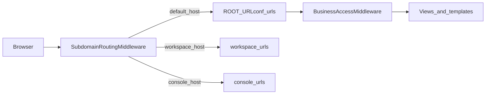

# BengalBound-HUB walkthrough

This document maps the **BengalBound-HUB** codebase: a **Django 6** multi-surface product that combines a marketing **public site**, internal **workspace** and **console** admin areas, a **community** forum, per-tenant **business hubs** (“BredBound”), and a large catalog of optional **`modules.*`** domain apps (CRM, MES, PMS, education, retail, and more).

---

## Executive summary

- **What you are building**: A modular **SaaS-style business operating system**. Each end customer has a **`BusinessInstance`** (slug, industry type, storage, optional IP lock / self-hosted sync). They activate capabilities from a **`ModuleCatalog`**; active installs are **`TenantModule`** rows. Employees are **`BusinessEmployee`** records with rich roles, optional **`CustomPosition`** for granular permissions, and optional **`accessible_modules`** restrictions.
- **How users reach it**: One Django project serves multiple “surfaces” via **`SubdomainRoutingMiddleware`** (different root URLconfs). Day-to-day operations for a company live under **`/hub/<business_slug>/…`** (and several suites under **`/hub/<suite-prefix>/<business_slug>/…`**).
- **What makes it large**: Dozens of Django apps under [`modules/`](modules/)—each can carry `models`, `urls`, `views`, `templates`, and migrations. The authoritative list of installed apps is [`bengalbound_core/settings.py`](bengalbound_core/settings.py) (`INSTALLED_APPS`).

---

## Tech stack (from runtime configuration)

| Area | Details |
|------|---------|
| Framework | Django **6.x** ([`bengalbound_core/settings.py`](bengalbound_core/settings.py)); file header comments may still mention Django 4.2 docs. |
| Auth | **django-allauth** (email login, mandatory email verification) + social providers (Google, Facebook, GitHub). Custom user: **`accounts.User`** (`AUTH_USER_MODEL`). |
| DB | Default **SQLite** at `BASE_DIR / 'db.sqlite3'`. Production can override via environment (not shown in the excerpted settings). |
| Config | **`python-dotenv`** loads [`.env`](.env) at project root (create locally; not committed here). |
| Static / media | `STATICFILES_DIRS = BASE_DIR / 'static'`, `MEDIA_ROOT` under `media/`. |
| Background work | **Celery** with dev-friendly in-memory / eager defaults; optional Beat schedule (commented examples for Serea). |
| AI (“Serea”) | Env keys: `GROQ_API_KEY`, `OPENAI_API_KEY`, `OPENROUTER_API_KEY`, `GOOGLE_SERVICE_ACCOUNT_JSON`. Facebook webhook verify: `FACEBOOK_WEBHOOK_VERIFY_TOKEN`. |

### `requirements.txt` (important)

The file [`requirements.txt`](requirements.txt) in this workspace is **not a valid pip requirements list** at the time of writing—it contains a **deployment / Nixpacks / Docker build log** (clone output, `pip` transcript, etc.). **Restore a real pinned dependency file** from version control or your deployment pipeline before onboarding or CI installs.

---

## Repository layout (spine)

| Path | Role |
|------|------|
| [`manage.py`](manage.py) | Django entry; `DJANGO_SETTINGS_MODULE=bengalbound_core.settings`. |
| [`bengalbound_core/settings.py`](bengalbound_core/settings.py) | Installed apps, middleware, templates, auth, Celery, AI keys. |
| [`bengalbound_core/urls.py`](bengalbound_core/urls.py) | Primary URL table: public site, workspace/console paths on main host, **all hub module includes**, Serea, admin. |
| [`bengalbound_core/middleware.py`](bengalbound_core/middleware.py) | **`SubdomainRoutingMiddleware`** — switches `request.urlconf` per dev hostname. |
| [`bengalbound_core/workspace_urls.py`](bengalbound_core/workspace_urls.py) | Workspace-only routes + Django admin on workspace host. |
| [`bengalbound_core/console_urls.py`](bengalbound_core/console_urls.py) | Console dashboard, Serea includes under `serea/`, **partial** hub includes (`bredbound`, task board, chat). |
| [`bengalbound_core/community_urls.py`](bengalbound_core/community_urls.py) | Community forum surface. |
| [`bredbound/`](bredbound/) | **Hub core**: businesses, modules, subscriptions, employees, connector tokens, sync API. |
| [`bredbound/middleware.py`](bredbound/middleware.py) | **`BusinessAccessMiddleware`** — resolves `request.current_business` for `/hub/<slug>/…` (see caveat below). |
| [`bredbound/context_processors.py`](bredbound/context_processors.py) | Injects hub sidebar data and resolves module landing URLs via `_MODULE_URL_MAP`. |
| [`bredbound/templatetags/hub_tags.py`](bredbound/templatetags/hub_tags.py) | Template tag `module_url` with a parallel **`MODULE_URL_MAP`** (keep in sync with context processor). |
| [`accounts/`](accounts/) | Custom `User`, workspace/customer profiles. |
| [`public_site/`](public_site/) | Marketing pages, trial/consult flows; uses `booking_calendar` models where relevant. |
| [`workspace_admin/`](workspace_admin/) | Internal ops: CMS, AI oversight, hub plan/subscription management, forum moderation. |
| [`console_admin/`](console_admin/) | Customer “console”: AI workforce, billing webhooks, Serea chat entry points. |
| [`community_forum/`](community_forum/) | Forum app for `community.*` host. |
| [`serea/`](serea/) | AI agent HTTP endpoints: chat send/history, Facebook webhook, permission responses. |
| [`modules/`](modules/) | Optional domain Django apps (see catalog below). |
| [`templates/`](templates/) | Global template dir; many hub screens under `templates/bredbound/`. |

---

## Request routing: subdomains and URLconfs

[`SubdomainRoutingMiddleware`](bengalbound_core/middleware.py) inspects `Host` (without port):

| Host (dev) | `request.urlconf` |
|------------|-------------------|
| `workspace.localhost` | `bengalbound_core.workspace_urls` |
| `console.localhost` | `bengalbound_core.console_urls` |
| `community.localhost` | `bengalbound_core.community_urls` |
| anything else | default **`ROOT_URLCONF`** → [`bengalbound_core/urls.py`](bengalbound_core/urls.py) |

[`CSRF_TRUSTED_ORIGINS`](bengalbound_core/settings.py) includes `http://localhost:1234` and matching `workspace` / `console` / `community` hosts—run the dev server on **port 1234** to match, or update settings.

### Mermaid: high-level HTTP flow



---

## Hub URLs: two mounting styles

[`bengalbound_core/urls.py`](bengalbound_core/urls.py) mixes:

1. **Business-first** paths — `hub/<slug:slug>/<segment>/…`  
   Example: `hub/acme-corp/crm/…` → CRM under slug **`acme-corp`**.

2. **Suite-first** paths — `hub/<segment>/…` (no business slug in the *outer* include)  
   Example: `hub/mes/<slug:slug>/…` → MES URLs; the inner [`modules/mes/urls.py`](modules/mes/urls.py) defines `<slug:slug>/` after the `hub/mes/` prefix.

**`BusinessAccessMiddleware` caveat** ([`bredbound/middleware.py`](bredbound/middleware.py)): it treats **the first path segment after `hub/`** as the business slug. For `hub/acme-corp/crm/` that is correct (`acme-corp`). For `hub/mes/acme-corp/` it interprets **`mes`** as the slug and will **not** attach `request.current_business` for the real company (unless a business literally has slug `mes`). Suite-first modules still receive the real slug via **URL kwargs** in their views; only middleware-injected `current_business` / context processor defaults that depend on it may differ for those routes.

---

## BredBound domain model (core product concepts)

Defined mainly in [`bredbound/models.py`](bredbound/models.py):

- **`BusinessInstance`**: tenant; `slug`, `business_type`, `installation_type` (`cloud` / `ip_locked` / `self_hosted`), quotas, `allowed_ips`, `sync_token`, branding fields.
- **`ModuleCatalog`**: productized module metadata (`module_id`, pricing, `applicable_to` JSON, `requires_modules`, `url_namespace`, flags).
- **`TenantModule`**: activation of a catalog row for a business (`tier`, `config` JSON).
- **`BusinessEmployee`**, **`CustomPosition`**, **`ConnectorSession`**, **`SyncLog`**: people, custom titles, remote connector tokens, self-hosted sync audit.
- **`INDUSTRY_MODULE_PRIORITY`**: suggested module order per `business_type`.
- **`HubPlanConfig`** and related subscription models (further down the same file): workspace-admin configurable tiers.

Catalog rows are seeded by:

```bash
python manage.py seed_modules
```

([`bredbound/management/commands/seed_modules.py`](bredbound/management/commands/seed_modules.py) — `update_or_create` by `module_id`.)

**Linking modules in the UI**: [`hub_context`](bredbound/context_processors.py) builds `hub_active_module_items` using **`ModuleCatalog.url_namespace`** and **`_MODULE_URL_MAP`**. If `url_namespace` is blank in the database, the resolved URL is `'#'` and the dashboard may treat the module as not yet navigable. A subset of entries in `seed_modules` explicitly sets `url_namespace`; for full navigation coverage, catalog rows should carry namespaces aligned with Django URL **namespaces** in [`bengalbound_core/urls.py`](bengalbound_core/urls.py).

---

## Primary URL map (main `ROOT_URLCONF`)

Below, **`{slug}`** means your `BusinessInstance.slug`.

| Prefix | Namespace / area | Notes |
|--------|------------------|--------|
| `/` | [`public_site`](public_site/urls.py) | Marketing, trial, affiliates. |
| `/admin/` | Django admin | |
| `/accounts/` | allauth + [`accounts`](accounts/urls.py) | |
| `/workspace/` | [`workspace_admin`](workspace_admin/urls.py) | On main host; workspace *subdomain* also mounts workspace stack at `/`. |
| `/console/` | [`console_admin`](console_admin/urls.py) | |
| `/community/` | [`community_forum`](community_forum/urls.py) | |
| `/hub/` | [`bredbound`](bredbound/urls.py) | Landing, create business, per-slug dashboard, module store, employees, settings, connector, subscription, `hub/api/sync/`. |
| `/hub/{slug}/board/` … | `task_board`, `team_chat`, … | Most slug-first modules (see table in next section). |
| `/hub/erp/{slug}/` … | `erp` | Suite-first include. |
| `/hub/mes/{slug}/` … | `mes` | Includes MES API webhook at `api/scanner/webhook/`. |
| `/hub/plm/{slug}/` … | `plm` | |
| `/hub/cadcam/` … | `cadcam` | |
| `/hub/assets/` … | `asset_management` | |
| `/hub/workshop/` … | `workshop` | Automotive. |
| `/hub/dms/` … | `dms` | |
| `/hub/dvi/` … | `dvi` | |
| `/hub/tms/` … | `tms` | |
| `/hub/wms/` … | `wms` | |
| `/hub/data-studio/` … | `data_studio` | |
| `/hub/process-mapper/` … | `process_mapper` | |
| `/hub/sis/` … | `sis` | Education. |
| `/hub/lms/` … | `lms` | |
| `/hub/assessments/` … | `assessments` | |
| `/hub/timetable/` … | `timetable` | |
| `/hub/parent-portal/` … | `parent_portal` | |
| `/hub/properties/` … | `property_listings` | Real estate. |
| `/hub/deals/` … | `deal_flow` | |
| `/hub/commission/` … | `commission` | |
| `/hub/re-marketing/` … | `re_marketing` | |
| `/hub/re-portal/` … | `re_client_portal` | |
| `/hub/omnichannel/` … | `omnichannel` | Retail. |
| `/hub/planogram/` … | `planogram` | |
| `/hub/product-catalog/` … | `product_catalog` | |
| `/hub/b2b/` … | `b2b_portal` | |
| `/hub/store-ops/` … | `store_ops` | |
| `/hub/{slug}/pms/` … | `pms`, `channel_manager`, `rate_manager`, `travel_crm`, `group_bookings`, `travel_desk`, `hospitality_ops` | Travel & accommodation (slug-first). |
| `/hub/{slug}/care/` … | `care_manager`, `garden_ops`, `data_collection` | Personal care / garden / data collection. |
| `/f/<form_slug>/` | `forms_builder` public | [`form_public`](modules/forms_builder/views.py) — no business slug. |
| `/serea/` | [`serea`](serea/urls.py) | Agent chat, logs, Facebook webhook. |

[`console_urls`](bengalbound_core/console_urls.py) additionally mounts **`/hub/`** (bredbound + board + chat) on the console host so operators can open a subset of hub URLs from the console subdomain.

---

## `modules.*` catalog

All of the following are registered in **`INSTALLED_APPS`** ([`bengalbound_core/settings.py`](bengalbound_core/settings.py)). Each package typically provides **`models.py`**, **`urls.py`** (with `app_name` matching the URL namespace), **`views.py`**, and often **`templates/<app_label>/`**. Schema changes live in **`migrations/`** per app.

### Collaboration

| App | Role (summary) |
|-----|----------------|
| [`modules.task_board`](modules/task_board/) | Kanban / tasks for a business slug. |
| [`modules.team_chat`](modules/team_chat/) | Team channels / chat. |

### CRM and sales

| App | Role (summary) |
|-----|----------------|
| [`modules.crm`](modules/crm/) | Contacts, deals, activities. |
| [`modules.leads`](modules/leads/) | Lead capture and pipeline. |
| [`modules.invoicing`](modules/invoicing/) | Invoices and billing UI. |
| [`modules.contracts`](modules/contracts/) | Contract records / workflow. |

### HR and people

| App | Role (summary) |
|-----|----------------|
| [`modules.hr`](modules/hr/) | Core HR records. |
| [`modules.payroll`](modules/payroll/) | Payroll (often depends on HR in seed data). |
| [`modules.recruitment`](modules/recruitment/) | Hiring pipeline. |
| [`modules.attendance`](modules/attendance/) | Time and attendance. |
| [`modules.shift_planning`](modules/shift_planning/) | Rosters / shifts. |
| [`modules.training`](modules/training/) | Training programs. |
| [`modules.expense`](modules/expense/) | Expense claims. |

### Finance

| App | Role (summary) |
|-----|----------------|
| [`modules.accounting`](modules/accounting/) | GL / bookkeeping style screens. |
| [`modules.budgeting`](modules/budgeting/) | Budgets and planning. |
| [`modules.financials`](modules/financials/) | Financial statements / reporting. |

### Operations and supply

| App | Role (summary) |
|-----|----------------|
| [`modules.inventory`](modules/inventory/) | Stock, products, lots / labels (evolving schema). |
| [`modules.order_mgmt`](modules/order_mgmt/) | Sales / purchase orders. |
| [`modules.bom`](modules/bom/) | Bill of materials. |
| [`modules.production`](modules/production/) | Manufacturing orders, consumption. |
| [`modules.quality_control`](modules/quality_control/) | QC inspections. |
| [`modules.maintenance`](modules/maintenance/) | Asset maintenance work. |
| [`modules.delivery`](modules/delivery/) | Delivery logistics (may be flagged “coming soon” in catalog seed). |

### Commerce

| App | Role (summary) |
|-----|----------------|
| [`modules.pos`](modules/pos/) | Point of sale. |
| [`modules.ecommerce`](modules/ecommerce/) | Online storefront flows. |
| [`modules.loyalty`](modules/loyalty/) | Loyalty programs. |
| [`modules.booking`](modules/booking/) | Reservations / bookings. |
| [`modules.table_mgmt`](modules/table_mgmt/) | Restaurant / hotel tables. |

### Marketing and comms

| App | Role (summary) |
|-----|----------------|
| [`modules.email_marketing`](modules/email_marketing/) | Campaigns. |
| [`modules.announcements`](modules/announcements/) | Internal announcements. |
| [`modules.documents`](modules/documents/) | Document management. |
| [`modules.website`](modules/website/) | Site / page builder hooks. |

### Intelligence

| App | Role (summary) |
|-----|----------------|
| [`modules.reports`](modules/reports/) | Reporting dashboards. |
| [`modules.ai_analytics`](modules/ai_analytics/) | AI-assisted analytics. |
| [`modules.ai_assistant`](modules/ai_assistant/) | In-product assistant. |
| [`modules.dashboard_pro`](modules/dashboard_pro/) | Advanced dashboarding. |

### Creation suite

| App | Role (summary) |
|-----|----------------|
| [`modules.docs`](modules/docs/) | Collaborative documents. |
| [`modules.sheets`](modules/sheets/) | Spreadsheets. |
| [`modules.slides`](modules/slides/) | Presentations. |
| [`modules.forms_builder`](modules/forms_builder/) | Form builder + public submit at `/f/<slug>/`. |

### Communication and productivity

| App | Role (summary) |
|-----|----------------|
| [`modules.business_mail`](modules/business_mail/) | Mailbox UI. |
| [`modules.video_meet`](modules/video_meet/) | Meetings. |
| [`modules.cloud_drive`](modules/cloud_drive/) | File storage UI tied to quota. |
| [`modules.business_calendar`](modules/business_calendar/) | Shared calendars. |

### Manufacturing and industrial

| App | Role (summary) |
|-----|----------------|
| [`modules.erp`](modules/erp/) | ERP dashboard, ledger, journals, POs. |
| [`modules.mes`](modules/mes/) | Manufacturing execution, work centers, scanner API. |
| [`modules.plm`](modules/plm/) | Product lifecycle. |
| [`modules.cadcam`](modules/cadcam/) | CAD/CAM integration surface. |
| [`modules.asset_management`](modules/asset_management/) | Industrial assets / tooling. |

### Automotive

| App | Role (summary) |
|-----|----------------|
| [`modules.workshop`](modules/workshop/) | Workshop / garage. |
| [`modules.dms`](modules/dms/) | Dealer management. |
| [`modules.dvi`](modules/dvi/) | Digital vehicle inspection. |

### Logistics

| App | Role (summary) |
|-----|----------------|
| [`modules.tms`](modules/tms/) | Transportation management. |
| [`modules.wms`](modules/wms/) | Warehouse management. |

### Consulting and analytics

| App | Role (summary) |
|-----|----------------|
| [`modules.data_studio`](modules/data_studio/) | Datasets / exploration. |
| [`modules.process_mapper`](modules/process_mapper/) | Process mapping. |

### Education

| App | Role (summary) |
|-----|----------------|
| [`modules.sis`](modules/sis/) | Student information. |
| [`modules.lms`](modules/lms/) | Courses / learning. |
| [`modules.assessments`](modules/assessments/) | Quizzes / tests. |
| [`modules.timetable`](modules/timetable/) | Scheduling. |
| [`modules.parent_portal`](modules/parent_portal/) | Parent / guardian portal. |

### Real estate

| App | Role (summary) |
|-----|----------------|
| [`modules.property_listings`](modules/property_listings/) | Listings. |
| [`modules.deal_flow`](modules/deal_flow/) | Transaction pipeline. |
| [`modules.commission`](modules/commission/) | Commissions. |
| [`modules.re_marketing`](modules/re_marketing/) | RE marketing. |
| [`modules.re_client_portal`](modules/re_client_portal/) | Client portal. |

### Retail and wholesale

| App | Role (summary) |
|-----|----------------|
| [`modules.omnichannel`](modules/omnichannel/) | Omnichannel retail. |
| [`modules.planogram`](modules/planogram/) | Shelf planning. |
| [`modules.product_catalog`](modules/product_catalog/) | PIM-style catalog. |
| [`modules.b2b_portal`](modules/b2b_portal/) | B2B ordering portal. |
| [`modules.store_ops`](modules/store_ops/) | Store operations. |

### Travel and accommodation

| App | Role (summary) |
|-----|----------------|
| [`modules.pms`](modules/pms/) | Property management system. |
| [`modules.channel_manager`](modules/channel_manager/) | OTA channel connectivity. |
| [`modules.rate_manager`](modules/rate_manager/) | Rates / restrictions. |
| [`modules.travel_crm`](modules/travel_crm/) | Travel-specific CRM. |
| [`modules.group_bookings`](modules/group_bookings/) | Groups / tours. |
| [`modules.travel_desk`](modules/travel_desk/) | Agency desk workflows. |
| [`modules.hospitality_ops`](modules/hospitality_ops/) | Day-to-day hospitality operations. |

### Personal care, home, and garden

| App | Role (summary) |
|-----|----------------|
| [`modules.care_manager`](modules/care_manager/) | Care scheduling / clients. |
| [`modules.garden_ops`](modules/garden_ops/) | Garden / field operations. |
| [`modules.data_collection`](modules/data_collection/) | Field data capture. |

---

## Other first-party apps

| App | Role |
|-----|------|
| [`accounts`](accounts/) | `AbstractUser` subclass, roles, workspace vs customer profiles. |
| [`public_site`](public_site/) | Marketing site; integrates models like **`booking_calendar.Appointment`** for consult/trial flows. |
| [`workspace_admin`](workspace_admin/) | Internal admin UI, CMS, Serea config, hub pricing/subscriptions. |
| [`console_admin`](console_admin/) | Customer console: AI hiring, chat, NowPayments webhook, daily reports. |
| [`community_forum`](community_forum/) | Forum threads for community subdomain. |
| [`booking_calendar`](booking_calendar/) | Appointment model support (no dedicated URLconf in root; used from `public_site`). |
| [`serea`](serea/) | AI runtime endpoints and Facebook webhook (see [`serea/urls.py`](serea/urls.py)). |

---

## Serea (AI engine)

- **URLs**: [`serea/urls.py`](serea/urls.py) — permission responses, chat send/history, moderation logs, **`webhook/facebook/`**.
- **Console integration**: [`console_admin/urls.py`](console_admin/urls.py) mounts `path('serea/', include('serea.urls'))` **without** app namespace repetition (uses `serea` app names inside).
- **Configuration**: API keys and service account JSON in settings; workspace has **`serea-config/`** routes for agent setup.

---

## Local development (quick start)

1. Create **`.env`** with at least `SECRET_KEY`, optionally `DEBUG=True`, `ALLOWED_HOSTS`, email and AI keys as needed.
2. **Python environment**: install dependencies from a **valid** requirements file (see warning above).
3. Run migrations: `python manage.py migrate`
4. Seed module catalog: `python manage.py seed_modules`
5. Create superuser if needed: `python manage.py createsuperuser`
6. Run dev server on a port matching **`CSRF_TRUSTED_ORIGINS`** (e.g. `python manage.py runserver 0.0.0.0:1234`).
7. Map **`workspace.localhost`**, **`console.localhost`**, **`community.localhost`** to `127.0.0.1` in your OS hosts file for subdomain testing.

---

## URL namespace verification (`urls.py` ↔ seed ↔ hub maps)

- **Django route namespaces** come from `include(..., namespace='…')` in [`bengalbound_core/urls.py`](bengalbound_core/urls.py). Each `modules.<pkg>.urls` should set matching `app_name`.
- **`seed_modules` explicit `url_namespace`**: only these catalog keys are written in [`bredbound/management/commands/seed_modules.py`](bredbound/management/commands/seed_modules.py):  
  `team_chat`, `task_board`, `erp`, `mes`, `plm`, `cadcam`, `asset_management`, `tms`, `wms`, `data_studio`, `process_mapper`, `property_listings`, `deal_flow`, `commission`, `re_marketing`, `re_client_portal`, `omnichannel`, `planogram`, `product_catalog`, `b2b_portal`, `store_ops`, `sis`, `lms`, `assessments`, `timetable`, `parent_portal`, `workshop`, `dms`, `dvi`, `pms`, `channel_manager`, `rate_manager`, `travel_crm`, `group_bookings`, `travel_desk`, `hospitality_ops`, `care_manager`, `garden_ops`, `data_collection`.  
  Most **slug-first** business modules (e.g. `crm`, `inventory`, `pos`) have **no** `url_namespace` in the seed dict; with the model default (`''`), [`hub_context`](bredbound/context_processors.py) resolves their **Open** link to `'#'` until `url_namespace` is populated in the database (e.g. set to the same string as the Django namespace / `module_id`).
- **Landing view names**: [`bredbound/context_processors.py`](bredbound/context_processors.py) `_MODULE_URL_MAP` uses names like `crm:index`, `inventory:index`, etc. [`bredbound/templatetags/hub_tags.py`](bredbound/templatetags/hub_tags.py) `MODULE_URL_MAP` still references some older names (e.g. `crm:contact_list`)—**treat the context processor as authoritative** for the hub sidebar until the two maps are deduplicated.

## Maintenance notes (for contributors)

1. **`_MODULE_URL_MAP` vs `MODULE_URL_MAP`**: [`bredbound/context_processors.py`](bredbound/context_processors.py) and [`bredbound/templatetags/hub_tags.py`](bredbound/templatetags/hub_tags.py) duplicate routing metadata—**keep them aligned** (today they differ on some keys, e.g. CRM entry view name).
2. **`ModuleCatalog.url_namespace`**: Should match keys used in those maps and Django URL namespaces from [`bengalbound_core/urls.py`](bengalbound_core/urls.py). Extend `seed_modules` (or a data migration) so every routable `module_id` gets a non-empty `url_namespace` when it matches a mounted namespace.
3. **`.claude/settings.json`**: Claude Code permission metadata only—not product documentation.

---

## Claude / tooling metadata

[`.claude/settings.json`](.claude/settings.json) records allowed shell patterns (migrations, `seed_modules`, etc.). [`.claude/settings.local.json`](.claude/settings.local.json) is a small local override. Neither defines application behavior.

---

*Generated to match the repository layout and key files as of the walkthrough authoring pass. For line-accurate behavior, follow the linked source files.*
